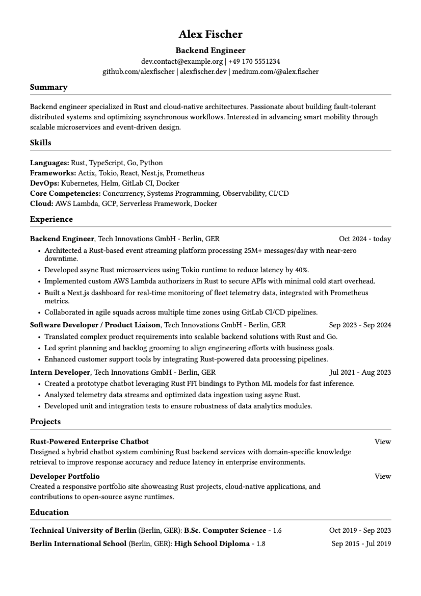
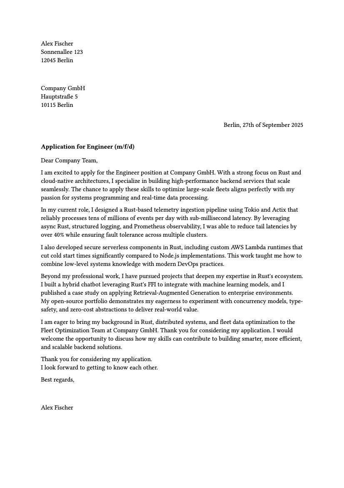

# Typst Career Docs

This project contains a curriculum vitae (CV) and a cover letter written in [Typst](https://typst.app).  
The content is stored in YAML files and loaded into reusable templates, so You can easily
generate both a pseudonymized and a personal version.

## CV example
<p align="center">
  <a href="cv/cv-public.pdf">
    
  </a>
</p>

## Cover letter example

<p align="center">
  <a href="cover-letter/cover-letter-public.pdf">
    
  </a>
</p>

## Structure

```bash
├── assets/
├── cover-letter/
│   ├── cover-letter.typ
│   ├── cover-letter-public.pdf
│   ├── letter.yaml          # Pseudonymized data (checked in)
├── cv/                  
│   ├── cv.typ
│   ├── cv-public.pdf
│   ├── me.yaml          # Pseudonymized data (checked in)
├── .gitignore
└── README.md
```

## Usage

Run the following commands to compile pdfs.

### Compile the public versions (no sys inputs)

```bash
cd cv
typst compile cv.typ cv-public.pdf
```

```bash
cd cover-letter
typst compile cover-letter.typ cover-letter-public.pdf
```

### Compile the private (personal) CV
```bash
cd cv
cp me.yaml cv-YOUR_NAME.yaml
# Fill YOUR_NAME.yaml with your data
typst compile --input data=cv-YOUR_NAME.yaml cv.typ cv-YOUR_NAME.pdf
```

### Compile the private (personal) cover letter
```bash
cd cover-letter
cp letter.yaml letter-YOUR_NAME.yaml
# Fill YOUR_NAME.yaml with your data
typst compile --input data=letter-YOUR_NAME.yaml cover-letter.typ cover-letter-YOUR_NAME.pdf
```

## Git Hygiene
YOUR_NAME.yaml contains sensitive personal data and is ignored by git.
cv-YOUR_NAME.pdf is also ignored.
Only the pseudonymized me.yaml and cv-public.pdf are included in version control.

## Why Typst?
* Modern alternative to LaTeX
* Clean syntax for templates
* Easy integration with structured data (e.g. YAML)
* Reproducible, version-controlled CVs