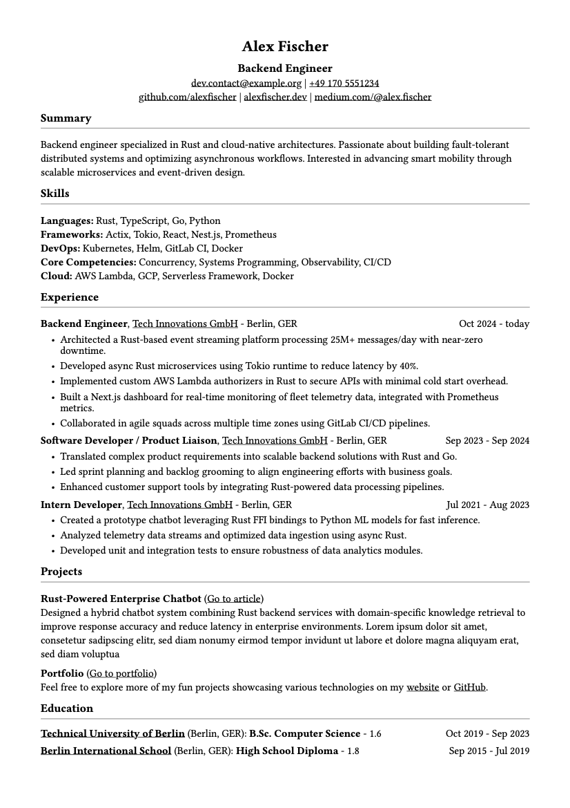

# Typst Career Docs

This project contains a curriculum vitae (CV) written in [Typst](https://typst.app).  
The content is stored in a YAML file and loaded into a reusable template, so You can easily
generate both a pseudonymized and a personal version.

<p align="center">
  <a href="cv-public.pdf">
    
  </a>
</p>

## Structure

```bash
├── assets # Image for GitHub
├── .gitignore
├── README.md
├── cv.typ
├── cv-public.pdf
├── me.yaml # Pseudonymized data (checked in)
└── YOUR_NAME.yaml # Personal data (ignored in git)
```

## Usage

### Compile the public pseudonymized CV
```bash
typst compile --input data=me.yaml cv.typ cv-public.pdf
```

### Compile the private (personal) CV
```bash
cp me.yaml YOUR_NAME.yaml
# Fill YOUR_NAME.yaml with your data
typst compile --input data=YOUR_NAME.yaml cv.typ cv-YOUR_NAME.pdf
```

## Git Hygiene
YOUR_NAME.yaml contains sensitive personal data and is ignored by git.
cv-YOUR_NAME.pdf is also ignored.
Only the pseudonymized me.yaml and cv-public.pdf are included in version control.

## Why Typst?
* Modern alternative to LaTeX
* Clean syntax for templates
* Easy integration with structured data (e.g. YAML)
* Reproducible, version-controlled CVs